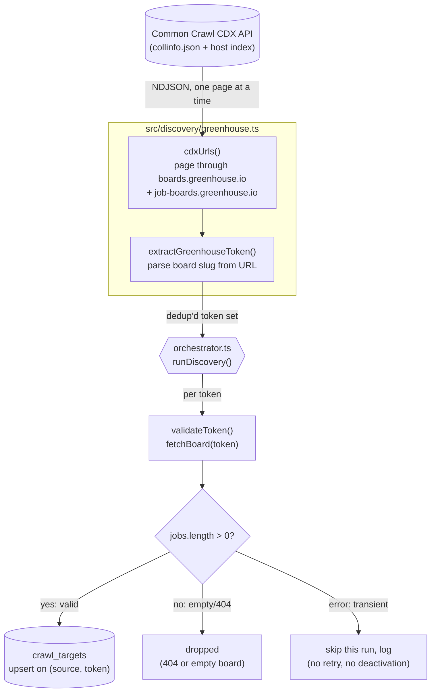
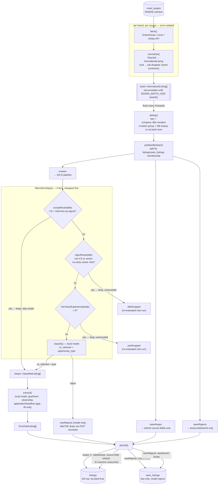
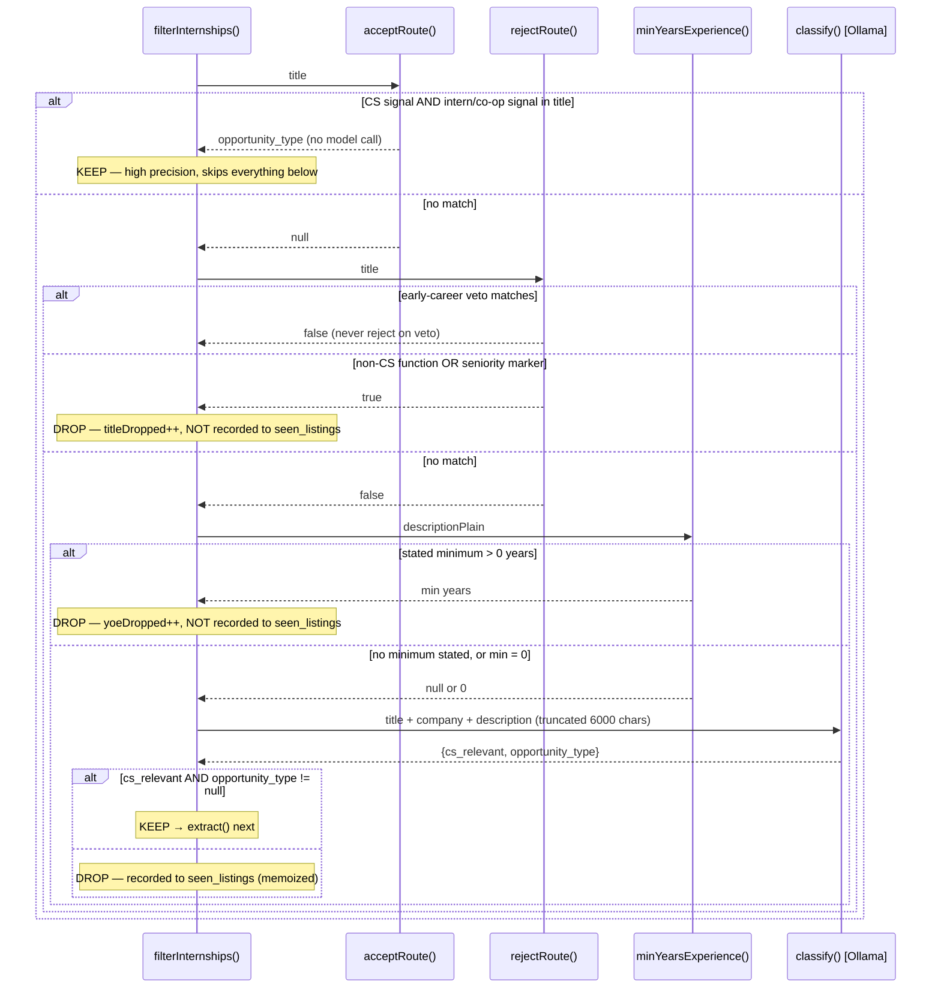

# Data Flow: Common Crawl → Finished Listing

Traces the two jobs that make up ingestion — `discover` (finds boards) and `refresh`
(crawls boards into listings) — end to end through the source files. See Decisions
9–15 in `DECISIONS.md` for the rationale behind each stage; this doc is the shape, not
the why.

## 1. Discovery: Common Crawl → `crawl_targets`

Run via `npm run discover`. One-time/monthly job that finds candidate board tokens and
confirms they're live. This is upstream of and separate from `refresh` — it populates
`crawl_targets`, which `refresh` later reads.

**Key points:** CDX paging is sequential and retried with backoff (transient 5xx/429
only — a 404 is a real answer, not retried). `--limit` caps token validation, not CDX
paging itself lets it stop paging early via `targetCount`. `isActive` is never flipped
false here — reactivation/pruning policy is still undecided (FIRST-DRAFT-MINE).

## 2. Refresh: `crawl_targets` → finished `listings` row

Run via `npm run refresh`. Reads active targets, fetches + normalizes per source, then
runs one shared tail across all three ATSes. `src/pipeline/orchestrator.ts` batches
this in `BOARD_BATCH_SIZE`-board chunks (default 10) so a crash mid-run only loses the
current chunk (Decision 15).

**Key points:**

- **Two-pass AI, not one.** `classify()` (cs_relevant + opportunity_type) and
  `extract()` (grad year / citizenship / deadline) are separate model calls, run on
  different subsets — extract only ever sees `keeps`. Splitting them means a change to
  extraction prompts never risks the classification decision, and vice versa.
- **Title/YoE drops are deliberately un-memoized.** Only a *model* reject writes to
  `seen_listings`. The two regex tiers drop for free every run, so recording them would
  buy nothing and would make a future regex fix unable to recover a wrongly-dropped
  listing (`partitionBySeen` never re-checks `seen_listings` content, only membership).
- **`seenKeeps` still updates.** Skipping the AI re-classify for an already-known keep
  doesn't mean skipping the DB write — source fields (title, location, deadline,
  description) still refresh from the latest crawl, just without touching the AI-derived
  columns. This is the fix for the "content freeze" bug noted in the audit.
- **Dedup runs before partition**, on the in-batch `NormalizedListing[]`, so it has to
  resolve both an in-batch duplicate (e.g. six identical reqs from one crawl) and a
  duplicate of an already-persisted canonical in one pass — see `dedup.ts` for the
  three-way branch (new canonical / self / suppress-and-merge).

## 3. Zoom-in: the filter stage's per-listing decision waterfall

The four-tier filter is the part most worth being able to whiteboard — it's a cost
ladder, not just a filter. Sequence for one listing:

