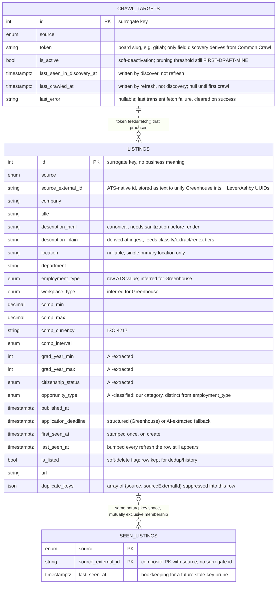

# Database Schema Diagram

Visual companion to [finalized_decisions/schema.md](../finalized_decisions/schema.md)
(the `listings` column-level spec) and [data-flow.md](data-flow.md) (how rows get
here). Source of truth is always `prisma/schema.prisma` — this is a rendering of it,
not a second spec. Full rationale for any field lives in `DECISIONS.md`; this doc only
notes what isn't obvious from the name.

## Entity relationship diagram

There are no Postgres foreign keys between these three tables — each is written by a
different pipeline stage and joined only implicitly, by the shared `(source,
source_external_id)` natural key. The dashed lines below mark that logical
relationship, not an enforced constraint.

## Reading the diagram

- **`LISTINGS` is the only table a user-facing query ever reads.** The other two exist
  purely to make the daily refresh idempotent and cheap — `crawl_targets` is discovery's
  output (Decision 11), `seen_listings` is the classifier's skip-memory (Decision 12).
- **`CRAWL_TARGETS → LISTINGS` isn't a row-level relation.** One target's board fetch
  produces zero-to-many raw jobs, each of which normalizes into at most one `Listing`
  row. There's no `crawl_target_id` column on `listings` — the link is "this token was
  crawled, its jobs became these rows," not a stored foreign key.
- **`LISTINGS` and `SEEN_LISTINGS` partition the same key space, never overlap.** A
  given `(source, source_external_id)` lives in exactly one of the two: a keep goes to
  `listings`, a model-rejected listing's key goes to `seen_listings`. `partitionBySeen()`
  (see data-flow.md) is what enforces this at read time — nothing enforces it as a DB
  constraint, since the two are separate tables by design (Decision 12: rejects never
  carry a full row, so non-CS content never reaches the product table).
- **`duplicate_keys` is the one denormalized column.** It's a JSON array, not a join
  table, because dedup.ts only ever reads/writes it as a whole and it's small (single
  digits observed, max 6) — see Decision 15 for why a join table would be ceremony here.
- **Two "seen" timestamps mean two different things.** `crawl_targets.last_seen_in_discovery_at`
  is about the *board* still existing on Common Crawl; `listings.last_seen_at` /
  `seen_listings.last_seen_at` are about the *listing* still being returned by a live
  crawl. Don't conflate them — a board can still be active discovery-wise while every
  job it ever posted has gone stale.
- **Every enum mirrors a Prisma enum 1:1** (`Source`, `EmploymentType`, `WorkplaceType`,
  `CompInterval`, `CitizenshipStatus`, `OpportunityType` in `prisma/schema.prisma`) —
  check there first if a value looks unfamiliar, rather than assuming this doc is stale.
